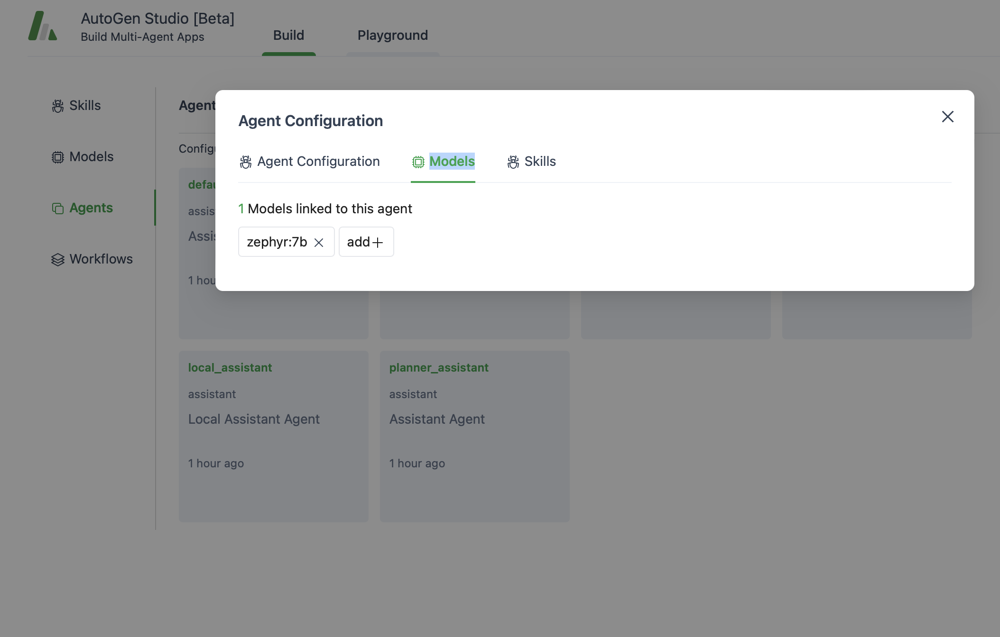

## About AutoGen and AutoGen Studio
**AutoGen** is a framework that enables the development of LLM applications using multiple agents that can converse with each other to solve tasks. AutoGen agents are customizable, conversable, and seamlessly allow human participation. They can operate in various modes that employ combinations of LLMs, human inputs, and tools.

**AutoGen Studio** is an AutoGen-powered AI app (user interface) to help you rapidly prototype AI agents, enhance them with skills, compose them into workflows and interact with them to accomplish tasks. It is built on top of the AutoGen framework, which is a toolkit for building AI agents.

## Start AutoGen Studio
```shell
cd <project root>
# autogenstudio ui --host 127.0.0.1 --port 8080 --reload --log-level debug --appdir ./autogen/studio/
autogenstudio ui --host 127.0.0.1 --port 8080 --appdir ./autogen/studio/
```

```powershell
# cd to the directory
cd $env:USERPROFILE\Documents\VCS\llm-agents;

# activate python env
$VERSION="3.12";
$ENV_NAME="agents";
$ENV_SURFIX="pip";
$ENV_FULL_NAME = "$ENV_NAME$VERSION$ENV_SURFIX";
& "$env:USERPROFILE\Documents\VENV\$ENV_FULL_NAME\Scripts\Activate.ps1";

# test python version
Invoke-Expression "(Get-Command python).Source";
# autogenstudio ui --host 127.0.0.1 --port 8080 --reload --log-level debug --appdir ./autogen/studio/

# start autogen studio ui
autogenstudio ui --host 127.0.0.1 --port 8080 --appdir ./autogen/studio/
```

## Reference:
* MSFT Autogen Repository https://github.com/microsoft/autogen
* Blog post: https://www.microsoft.com/en-us/research/blog/introducing-autogen-studio-a-low-code-interface-for-building-multi-agent-workflows/
* Paper: https://arxiv.org/abs/2408.15247
* Autogen Studio https://github.com/microsoft/autogen/tree/main/samples/apps/autogen-studio
* AutoGen github https://github.com/microsoft/autogen

## Trouble shot
While using the local ollama zephyr:7b model in AutoGen Studio
You need to remove all the gpt-4-preview model from the Agent Config of all the default and travel agents in Agents menu, in Models tab.



* default_assistant
* user_proxy
* travel_groupchat
* language_assistant
* local_assistant
* planner_assistant

otherwise you will receive a openai_key needed error.

## Function calling leader board
* https://gorilla.cs.berkeley.edu/leaderboard.html
